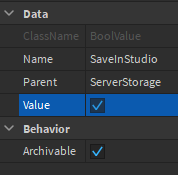

In this example, we're going to create a basic "simulator" game. If you do not have DataStore2 installed, [read the installation guide](../installation).

In our game, we're going to have a brick that when a player clicks on it, they'll get points.

After installing DataStore2, create a "Part" in the workspace, then put a "ClickDetector" inside of it. Name the part something like PointsPart. Your workspace should look like this:


Next, we're going to create a leaderstats board. Create a script in ServerScriptService with the following code.

```lua
local Players = game:GetService("Players")
local ServerScriptService = game:GetService("ServerScriptService")
local Workspace = game:GetService("Workspace")

local DataStore2 = require(ServerScriptService.DataStore2)

-- Combine every key you use. This will eventually be the default, but for now read the "Gotchas" section to understand why we need this.
DataStore2.Combine("DATA", "points")

Players.PlayerAdded:Connect(function(player)
	local pointsStore = DataStore2("points", player)

	local leaderstats = Instance.new("Folder")
	leaderstats.Name = "leaderstats"

	local points = Instance.new("NumberValue")
	points.Name = "Points"
	points.Value = pointsStore:Get(0) -- The "0" means that by default, they'll have 0 points
	points.Parent = leaderstats

	pointsStore:OnUpdate(function(newPoints)
		-- This function runs every time the value inside the data store changes.
		points.Value = newPoints
	end)

	leaderstats.Parent = player
end)
```

Click "Play", and look at the top right of your screen. You should see this:


Now, we have to let the player actually get points. Write the following code after the connection:

```lua
Workspace.PointsPart.ClickDetector.MouseClick:Connect(function(player)
	local pointsStore = DataStore2("points", player)
	pointsStore:Increment(1) -- Give them 1 point
end)
```

Go in game, and click the brick to your heart's content. You should be getting points! If you play your game on roblox.com, you'll be able to get points, leave, come back, and the points you had last time should save!

However, you'll notice that if you play the game in *studio*, your points *won't* save. This is because **DataStore2 does not save in studio by default**. Usually, you don't want to save in studio because you don't want broken data while you're developing, and you don't want to have to wait for your data to save every time. However, you can change this yourself.

Create a "BoolValue" in ServerStorage named "SaveInStudio". It should look like this:


Now, make sure the checkbox is checked.



You'll now be able to play over and over again as much as you want, and your data will save!
